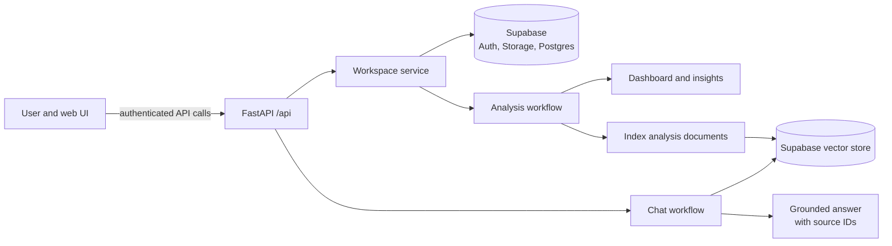
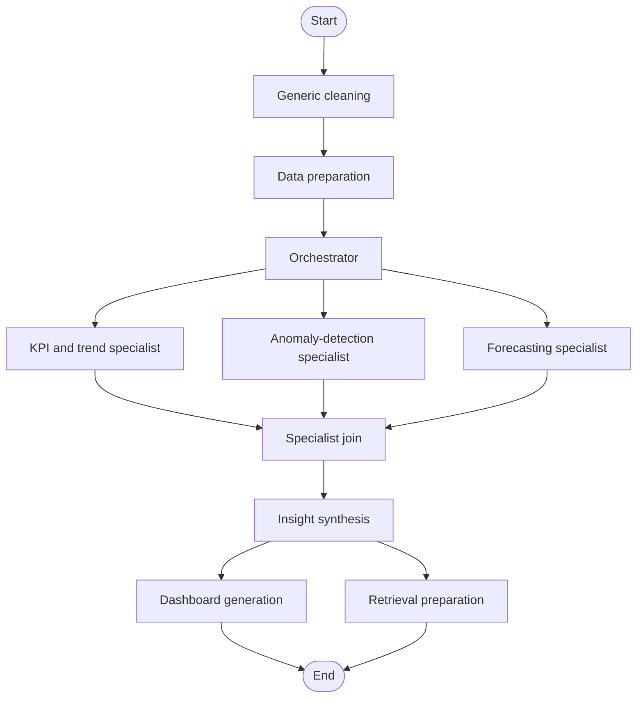
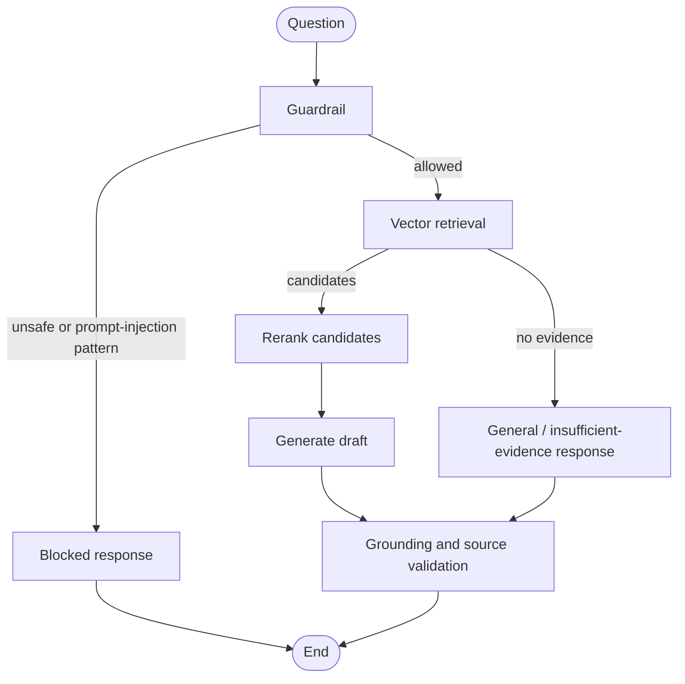

<div align="center">
<pre>
███╗   ███╗ █████╗ ██████╗ ███████╗
████╗ ████║██╔══██╗██╔══██╗██╔════╝
██╔████╔██║███████║██████╔╝███████╗
██║╚██╔╝██║██╔══██║██╔══██╗╚════██║
██║ ╚═╝ ██║██║  ██║██║  ██║███████║
╚═╝     ╚═╝╚═╝  ╚═╝╚═╝  ╚═╝╚══════╝
</pre>
</div>

# MARS — Multi-Agent RAG System

MARS is a business-intelligence application that turns uploaded tabular data
into a dashboard, recommendations, and grounded follow-up answers. It is built
for people who need useful answers from their own data without treating a
language model as the source of truth: calculations, retrieval, source IDs,
guardrails, and validation sit around the model calls.

The backend is a FastAPI service. Its default `multi` mode uses a LangGraph
workflow of specialist agents; a compatible `single` mode is also available for
comparison or a simpler deployment. Supabase supplies authentication, dataset
storage, persistence, and vector search.

## What happens when a dataset is uploaded

1. A signed-in user uploads one or more CSV, Excel, or JSON files.
2. MARS stores the files in the user's workspace, combines them where needed,
   and prepares a clean in-memory data frame.
3. The analysis workflow builds a dashboard with KPIs, charts, insights, and
   recommended actions.
4. MARS creates retrieval documents from the completed analysis and indexes
   them for the workspace.
5. The user can ask questions about that workspace. Answers are based on its
   retrieved evidence, or MARS says when the evidence is insufficient.

This makes “multi-agent” practical here: agents have defined jobs, structured
inputs/outputs, and an orchestrated hand-off rather than an unconstrained group
chat.

## Key capabilities

- Workspace-scoped analysis of CSV, XLS/XLSX, and JSON tabular datasets.
- Multi-agent dashboard generation with data preparation, planning, specialist
  analysis, synthesis, and dashboard assembly.
- Dataset chat protected by prompt-injection guardrails, vector retrieval,
  reranking, grounded generation, and source validation.
- Deterministic calculations for supported numerical questions, so simple
  calculations need not depend on an LLM.
- Supabase-backed authentication, storage, analysis persistence, messages, and
  vector retrieval.
- LangSmith quality experiments, RAGAS retrieval/answer evaluation, and Python
  unit, integration, and end-to-end tests.

## System overview



The API is stateless between requests where possible; durable workspace,
dataset, dashboard, message, and retrieval data are held in Supabase. LLM model
and RAG policies are version-controlled in `config/`.

## Requirements

- Python 3.11 (the production image uses Python 3.11).
- A Supabase project configured for the application's database, storage bucket,
  authentication, and vector-search functions.
- A Groq API key for the configured agent models. An OpenRouter key is needed
  only if you switch an agent policy to the OpenRouter provider.
- A Hugging Face token where downloading the configured embedding/reranker
  models requires it.
- Docker Desktop, if running the production container locally.

## Quick start (development)

From the parent implementation directory, run:

```powershell
cd "Multi-Agent-RAG-Platform-Engine"
python -m venv .venv
.\.venv\Scripts\Activate.ps1
python -m pip install --upgrade pip
python -m pip install -r requirements.txt
Copy-Item .env.sample .env
```

Fill in the values in `.env`; do not commit it. At minimum, a working runtime
needs `SUPABASE_URL`, `SUPABASE_SERVICE_ROLE_KEY`, and `GROQ_API_KEY`. For the
default multi-agent mode, leave `BI_PIPELINE_MODE=multi`.

For a **new** Supabase project, create a private `datasets` Storage bucket and
apply [`scripts/db.sql`](scripts/db.sql) once through the Supabase SQL editor
before starting the API. It is a first-time, non-destructive schema bootstrap:
it creates the application tables and profiles existing Supabase Auth accounts,
but does not drop or migrate existing objects. Use a dedicated migration—not
this bootstrap—when the application schema already exists.

Start the development server with automatic reload:

```powershell
python -m uvicorn app.main:app --reload --host 127.0.0.1 --port 8000
```

Useful checks:

```powershell
Invoke-RestMethod http://127.0.0.1:8000/api/health
# Expected: @{status = "ok"}
```

The interactive OpenAPI documentation is available at
`http://127.0.0.1:8000/docs` while the server is running.

On macOS/Linux, activate the virtual environment with:

```bash
source .venv/bin/activate
```

## Production run (Docker)

The provided Dockerfile installs only the service runtime and starts Uvicorn on
port 8000. Build and run it from this directory:

```powershell
docker build -t mars-api:latest .
docker run --rm --env-file .env -p 8000:8000 mars-api:latest
```

For a long-running deployment, use your platform's secret manager instead of
shipping a local `.env` file, expose the container only behind HTTPS, and set
`CORS_ALLOWED_ORIGINS` to the deployed UI origin(s). The container healthcheck
uses `GET /`; platform readiness probes can use `GET /api/ready`.

## Configuration

Copy [`.env.sample`](.env.sample) to `.env` and replace placeholder values.

| Setting | Purpose |
| --- | --- |
| `CORS_ALLOWED_ORIGINS` | Comma-separated browser origins allowed to call the API. |
| `BI_PIPELINE_MODE` | `multi` (default) for the LangGraph specialist workflow, or `single` for the compatible single-agent path. |
| `SUPABASE_URL` | Supabase project URL. |
| `SUPABASE_SERVICE_ROLE_KEY` | Server-side Supabase credential. Keep it secret; never expose it to the browser. |
| `SUPABASE_STORAGE_BUCKET` | Dataset-storage bucket; defaults to `datasets`. |
| `GROQ_API_KEY` | Key used by the default agent and evaluation models. |
| `OPENROUTER_API_KEY` | Required only for policies that select OpenRouter. |
| `HF_TOKEN` | Hugging Face access token for model downloads when needed. |
| `LANGSMITH_TRACING`, `LANGSMITH_API_KEY`, `LANGSMITH_PROJECT` | Optional tracing and LangSmith experiment configuration. |
| `EVAL_JUDGE_MODEL`, `EVAL_REPETITIONS`, `EVAL_MAX_CONCURRENCY` | LangSmith quality-evaluation controls. |
| `RAGAS_EVALUATOR_MODEL` | Optional override for the offline RAGAS judge model. |

`config/agents.groq.toml` defines each agent's provider, model, temperature,
token budget, and reasoning effort. The checked-in default assigns
`openai/gpt-oss-20b` to focused tasks and chat, and
`openai/gpt-oss-120b` to synthesis/dashboard work. `config/rag.toml` defines
the retrieval policy: BGE-small embeddings (384 dimensions), an eight-document
vector search, `BAAI/bge-reranker-v2-m3` reranking, and four chat-context
documents.

## Analysis workflow (multi-agent mode)

The primary workflow is compiled by
[`app/orchestration/graphs/analysis_graph.py`](app/orchestration/graphs/analysis_graph.py).
Its state is an `AnalysisState` passed between named LangGraph nodes.



The flow is deliberately split between deterministic and generative work:

- **Generic cleaning** applies baseline cleaning and records the result.
- **Data preparation** profiles the workspace data and produces a preparation
  plan that the rest of the workflow can safely use.
- **Orchestrator** selects and configures the specialist work required for the
  dataset and question; specialists can be skipped where inappropriate.
- **KPI/trend, anomaly detection, and forecasting** produce structured,
  evidence-bearing findings. They fan out after planning and fan in at the
  specialist join.
- **Insight synthesis** converts specialist outputs into a coherent
  business-level account, while retaining limitations and provenance.
- **Dashboard generation** creates the validated dashboard response.
- **Retrieval preparation** builds documents for the workspace's later chat
  retrieval/indexing path.

### Execution, persistence, and recovery details

Uploaded workspace data is cleaned and persisted as Parquet, but the
multi-agent graph hands in-memory pandas DataFrames between its analysis nodes;
it does not create temporary CSVs at each stage. After the dashboard is
persisted, vector indexing can continue as a background task. The workspace
reports `ragStatus: indexing` until indexing records `ready` or `failed`; chat
and dataset mutations wait for that process to finish.

Cleaning, preparation, dashboard generation, and persistence are required
stages. Specialist and retrieval-preparation failures can still yield a
`partial` dashboard with visible warnings. Forecasting is deterministic and
uses the fixed Chronos-2 engine (`amazon/chronos-2`); it does not rely on an
LLM to calculate the forecast itself.

Prompt bundles live under `app/prompts/` as version-controlled TOON files. They
are decoded and validated during start-up. Structured model responses are
validated with Pydantic, and the provider layer uses bounded recovery attempts
before selecting a deterministic fallback.

The pipeline runner in
[`app/services/analysis/pipelines.py`](app/services/analysis/pipelines.py)
marks an execution `success`, `partial`, or `failed`. A dashboard can be
returned as `partial` if optional specialist work fails or if a safe fallback
was required; this avoids reporting a deceptively complete result.

### Single-agent comparison mode

Set `BI_PIPELINE_MODE=single` to use the compact
`BusinessIntelligenceAgent`. It profiles the dataset and creates the dashboard
through one LangGraph path, with a separate chat branch for calculation,
retrieval, reranking, and response generation. This is useful as a baseline;
the API contract stays compatible with multi-agent mode.

## RAG chat workflow

The chat graph is compiled by
[`app/orchestration/graphs/chat_graph.py`](app/orchestration/graphs/chat_graph.py).
It operates only within the active user's indexed workspace.



The retrieval route performs session-scoped vector search, then reranks the
candidate documents before model generation. If retrieval returns no
candidates, MARS returns a helpful insufficient-context response rather than
making an unsupported claim. The final grounding step checks the draft against
the returned evidence and source IDs. Timeouts and failures produce a safe
fallback response.

Recent conversation history helps interpret follow-up questions, but retrieved
workspace documents are the only accepted factual evidence. BGE-small creates
normalised 384-dimensional embeddings; the Supabase `document_chunks` vector
column and search function must use the same 384 dimensions. Treat a change to
embedding dimensions as a schema migration and rebuild derived vectors before
serving chat again.

## HTTP API

All application endpoints are under `/api`; workspace endpoints require a
Supabase-issued access JWT. Common endpoints are:

| Endpoint | Purpose |
| --- | --- |
| `GET /api/health` | Liveness check. |
| `GET /api/ready` | Readiness check. |
| `POST /api/upload` | Upload one or more files and run workspace analysis. |
| `GET /api/datasets` | Read active workspace/dataset details. |
| `POST /api/datasets/preview` | Retrieve a paginated data preview. |
| `DELETE /api/datasets/{dataset_id}` | Remove a dataset and reanalyse as appropriate. |
| `GET /api/dashboard` | Retrieve the active dashboard. |
| `POST /api/workspace/reset` | Reset the active workspace. |
| `POST /api/chat` | Ask a grounded question about the active workspace. |
| `GET /api/chat/history` | Retrieve saved conversation history. |
| `POST /api/chat/reset` | Clear workspace chat history. |
| `GET /api/chat/status` | Check chat/index status. |
| `POST /api/chat/rebuild` | Start a background rebuild of retrieval documents. |

Use `/docs` for request and response schemas rather than treating this table as
a replacement for the OpenAPI contract.

`POST /api/upload` accepts one to five multipart `files` fields. MARS prepares
different schemas independently, synthesises them into one session dashboard
and retrieval index, and clears chat history when the dataset set changes.
Questions normally use every dataset in the active workspace; explicitly naming
a file narrows the question to that dataset.

## Evaluation

MARS uses two complementary evaluation suites. They answer different questions
and should be reported separately.

| Suite | Assesses | Command |
| --- | --- | --- |
| LangSmith quality evaluation | Multi-agent/dashboard planning, chat guardrails, query safety, and other defined quality targets. | `python -m evaluation.langsmith.quality_runner` |
| RAGAS evaluation | Production chat retrieval, reranking, evidence grounding, and final-answer quality. | `python -m evaluation.ragas.runner --session-id <id>` |

### Run the LangSmith quality suite

Set `LANGSMITH_TRACING=true`, `LANGSMITH_API_KEY`, and `LANGSMITH_PROJECT` to
send repeated experiments to LangSmith. The local run verifies the same target
and evaluator wiring without creating a remote experiment.

```powershell
# Local quality results in evaluation/langsmith/results/
python -m evaluation.langsmith.quality_runner

# Synchronise datasets and create a LangSmith experiment
python -m evaluation.langsmith.quality_runner --langsmith --repetitions 3 --max-concurrency 1

# Create a compact quality summary
python -m evaluation.langsmith.summarize_quality
```

See [`evaluation/langsmith/README.md`](evaluation/langsmith/README.md) for suite
definitions, metric interpretation, and judge-agreement guidance.

### Run the RAGAS suite

RAGAS uses the real production chat graph, not the HTTP API. Create a dedicated
evaluation workspace through MARS first; do not use a real user's workspace.
After the workspace contains its evaluation dataset, replace only that
workspace's index with the checked-in corpus:

```powershell
# Index the checked-in evaluation data into the dedicated workspace
python -m evaluation.ragas.runner --session-id <dedicated-evaluation-session-id> --index-evaluation-data

# Run the full retrieval, generation, and offline RAGAS judge evaluation
python -m evaluation.ragas.runner --session-id <dedicated-evaluation-session-id> --repetitions 3

# Retrieval and graph-capture dry run; skips offline RAGAS judge calls
python -m evaluation.ragas.runner --session-id <dedicated-evaluation-session-id> --skip-ragas
```

The results are written to `evaluation/ragas/results/`, including case-level,
summary, and reranker-comparison files. See
[`evaluation/ragas/README.md`](evaluation/ragas/README.md) for prerequisites,
metrics, and interpretation.

## Python tests

Run the complete automated test suite:

```powershell
python -m pytest
```

Useful targeted commands:

```powershell
# Fast, isolated tests
python -m pytest tests/unit

# Service and graph integration tests
python -m pytest tests/integration

# Full API/workspace flows using test doubles
python -m pytest tests/end_to_end

# Evaluation-suite tests
python -m pytest tests/unit/evaluation tests/integration/retrieval/test_ragas_runner.py

# A concise pass/fail run
python -m pytest -q
```

The tests are designed to avoid calling external providers where possible;
LangSmith and RAGAS commands above are explicit evaluation runs and may use the
configured external services.

## Repository guide

```text
app/
  api/                 FastAPI routes and authentication boundary
  agents/              Specialist and single-agent implementations
  orchestration/       LangGraph states, nodes, and workflow wiring
  rag/                 Document building, embeddings, retrieval, reranking
  services/            Workspace, analysis, indexing, chat, and persistence facades
  core/                Settings, providers, prompts, logging, tracing
  schemas/             Pydantic API and workflow contracts
config/
  agents.groq.toml     Version-controlled LLM policies
  rag.toml             Chunking, embedding, reranking, retrieval policies
evaluation/
  langsmith/           Quality datasets, targets, evaluators, and reports
  ragas/               Retrieval and grounded-answer evaluation suite
tests/
  unit/ integration/ end_to_end/
Dockerfile              Production API image
.env.sample             Required environment-variable template
```

## Operational notes

- Keep the Supabase service-role key and provider keys server-side. Never place
  them in the frontend bundle or commit `.env`.
- The first run may take longer while local embedding and reranker models are
  downloaded and warmed.
- Changing a model or RAG policy should be treated as a behaviour change: run
  Python tests, then the appropriate LangSmith and/or RAGAS evaluation before
  reporting quality results.
- For deployed systems, monitor `/api/health`, application logs, provider
  errors, and the persisted workflow status (`success`, `partial`, or `failed`).
